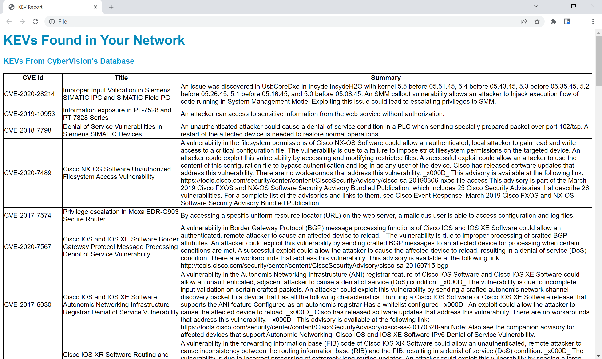

# CyberVision KEV Report

This python script utilizes CyberVision's CVE (Common Vulnerabilities and Exposures) report and identifies the KEVs (Known Exploited Vulnerabilities), outputting them to an html file for easy readibility. This allows the customer to prioritize which vulnerabilities to patch as KEVs have a higher importance from CVEs.

## Steps
1. Download this repository as a zip file
2. Unzip the file and place your CyberVision CVE report in this folder
3. Run the ```find-kevs.exe``` file
4. Open the ```kev-report.html``` file in your browser to view the results

